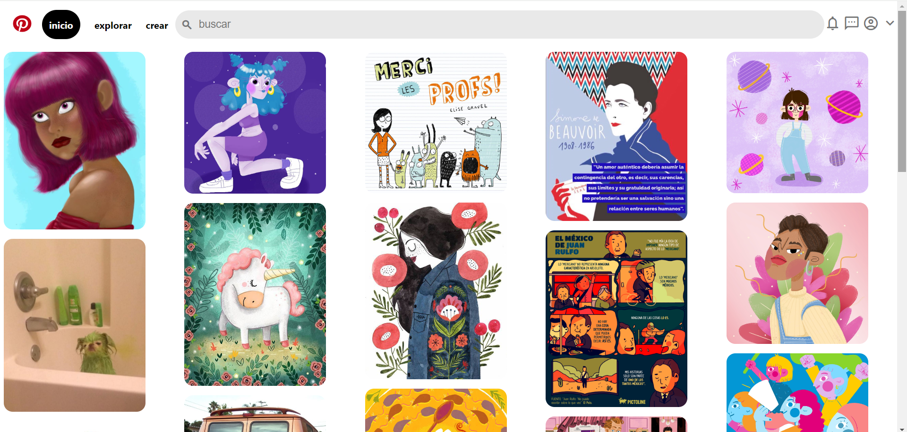

# Clon de Pinterest con HTML y CSS
Este proyecto es un clon de la intefáz de usuario de Pinterest, creado  puramente con HTML y CSS.
Se enfoca en replicar la apariencia visual de Pinterest, ofeciendo una experiencia de navegación similar con un diseño responsive y funcionalidades básicas.

### Carácteristicas
* **Diseño Responsive:** Adaptable a diferentes tamaños de pantalla para una experiencia de usuario óptima en dispositivos móviles y de escritorio.
* **Interfaz de usuario intuitiva:** Inspirada en Pinterest con navegación fácil y accesible.
* **Interacciones dinámicas:** efectos visuales para elementos interactivos como botones y enlaces.
* **Iconografía y estilos modernos:** Uso de la bibloteca de íconos de Material Design y estilos CSS modernos para una apariencia novedosa.

### Tecnologías Utilizadas
+ **HTML**Para la estructura básica del sitio.
+ **CSS** Para eldiseño y el estilo, incluyendo _Flexbox_ para un diseño responsivo y efectos de _Hover._
+ **GOOGLE icons** Para uso de laiconografia del sitio.

### Vista previa de proyecto

Este es mi primer proyecto Frontend realizado en el Bootcamp de TecnoLochicas 2024

Te dejo mi [Linkedin](https://www.linkedin.com/in/graciela-martinez-7792381b3/)

